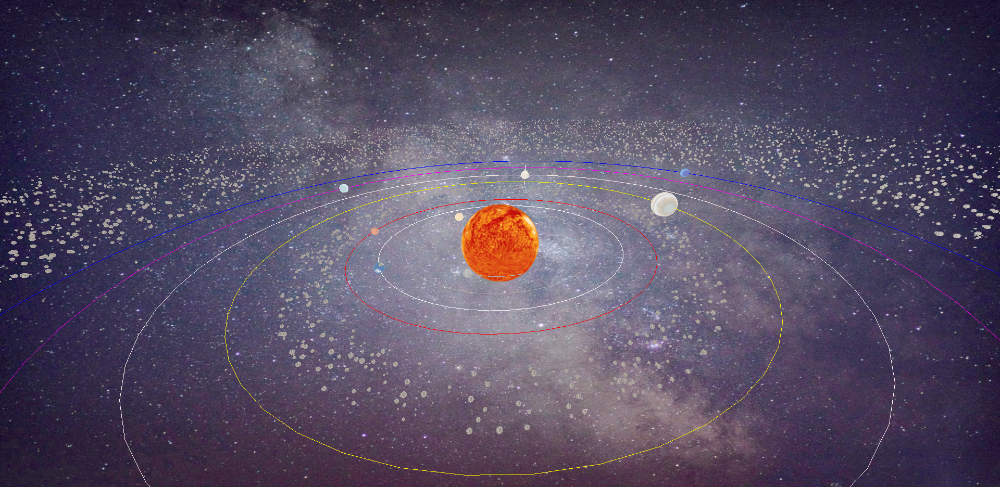

# Solar-System Simulation Project

The Solar-System Simulation Project is a website that allows you to simulate the motion of planets in our solar system.

## Features

The Solar-System Simulation Project has the following features:

- Interactive 3D visualization of the solar system.
- Zoom in/out functionality to explore the solar system in detail.
- Information about the planets

## Installation

To install and run the Solar-System Simulation Project on your computer, follow these steps:

1. Clone the repository to your local machine using Git or download the ZIP file and extract it to a local folder.
2. Install [Node.js](https://nodejs.org/) on your machine if you don't have it already.
3. Open a terminal window and navigate to the project folder.
4. Run `npm install` to install the necessary dependencies.

## Usage

Once the Solar-System Simulation Project is running, you can interact with it in the following ways:

- Use the mouse to pan and zoom the solar system.
- Click on a planet to see information about it.

## Credits

This project was developed by [Javkhlan](https://github.com/Skitarii11) as a Personal project using [JavaScript/Vite.js/Vanilla.js/Three.js].
